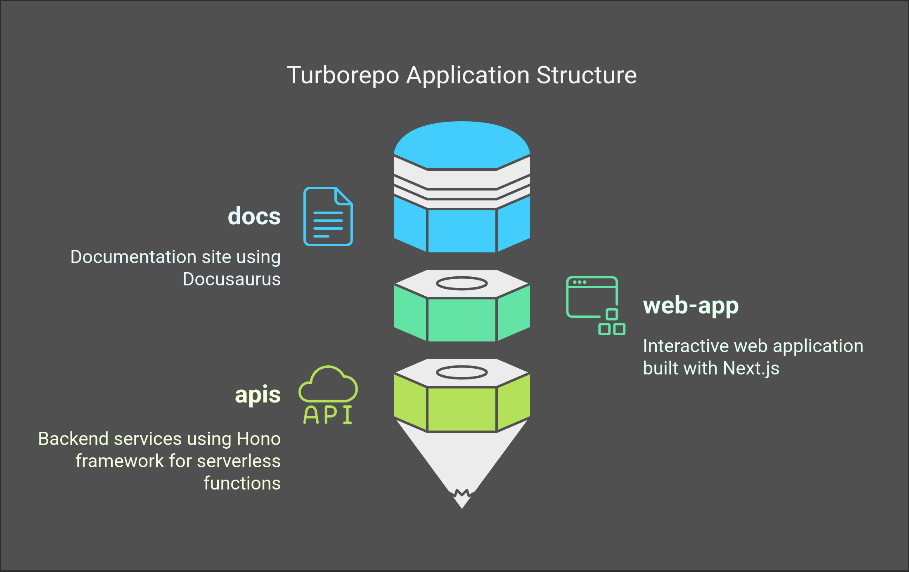
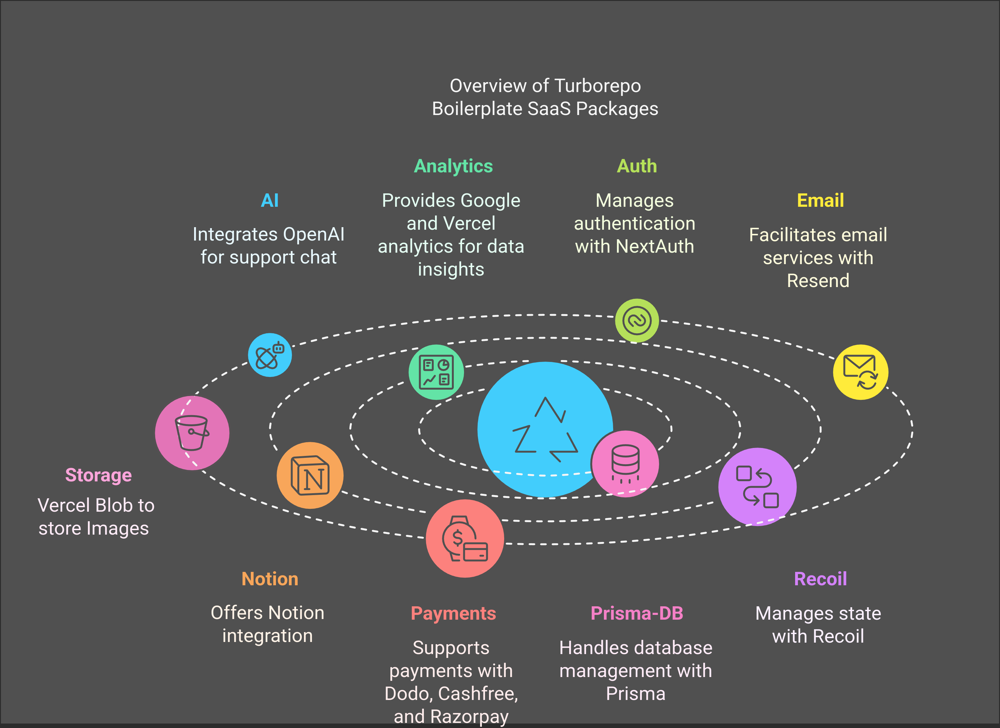
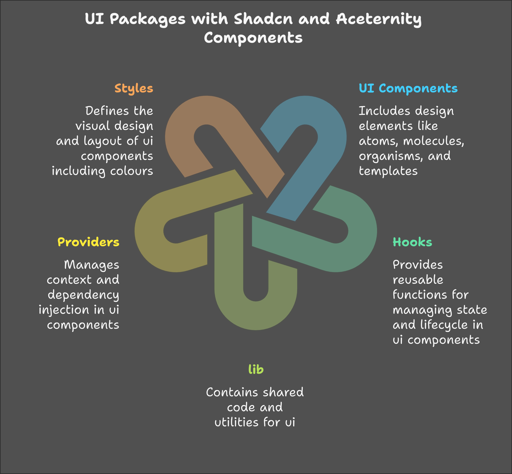

# COMPLETE SAAS BOILERPLATE CODE

## Overview

MicroSaaS products are one of the most exciting ways to create impactful software with minimal resources. They allow solopreneurs and small teams to quickly launch, validate and iterate on ideas. To help developers hit the ground running, I built a boilerplate for MicroSaaS products using a **TurboRepo monorepo setup** and am excited to share it with the open-source community. For more details, got to these [overview docs](https://docs.boilerplate.bayesian-labs.com/docs/overview) in the documentation.

## Starting Locally

Use the documentation link, to start this boilerplate quickly locally - [development docs](https://docs.boilerplate.bayesian-labs.com/docs/category/getting-started)

## Deploy Your Own

1) You can deploy it to Vercel with one click:

    

2) Give a repository name which will clone this repo to your account but fail buidling.
3) In the project built in vercel go to Settings and in Environment variables fill all the variables according to these [docs](https://docs.boilerplate.bayesian-labs.com/docs/getting-started/start-locally)

## License

This project is licensed under the MIT License. See the [LICENSE](LICENSE) file for details.
